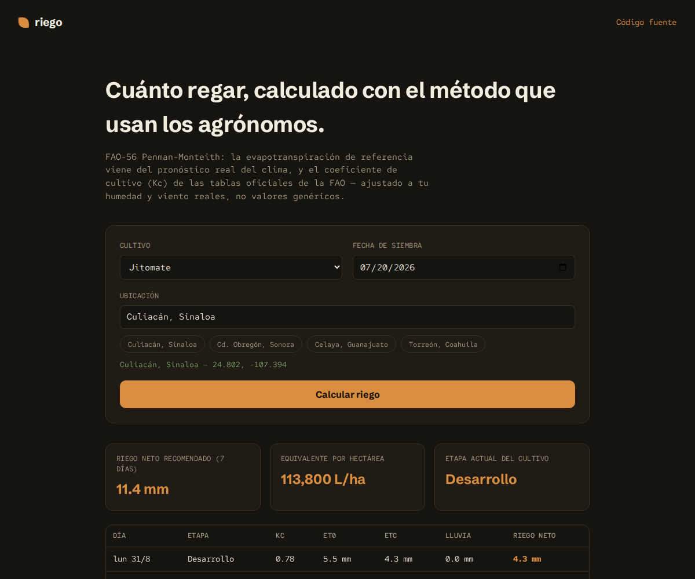

# riego

[](https://github.com/mxnueel/riego/actions/workflows/ci.yml)
[](https://github.com/mxnueel/riego/actions/workflows/deploy.yml)
[](LICENSE)

**Live: [mxnueel.github.io/riego](https://mxnueel.github.io/riego/)**



Elige un cultivo, tu fecha de siembra y una ubicación en México, y obtén una recomendación real de riego — calculada con el método FAO-56 Penman-Monteith, el estándar mundial que se enseña en ingeniería agrícola, usando pronóstico del clima real. Sin servidor, sin cuenta.

## Por qué

Los otros proyectos de este perfil son herramientas de software puro. Este es distinto: es el primero que aplica directamente mi carrera, Ingeniería en Mecatrónica Agrícola. La evapotranspiración de referencia (ET0) la calcula [Open-Meteo](https://open-meteo.com) a partir de datos meteorológicos reales — eso es la parte fácil, una sola llamada a una API. Lo que realmente construí encima es la ingeniería: tomar esa ET0 cruda y aplicarle los coeficientes de cultivo oficiales de la Tabla 12 de la [FAO-56](https://www.fao.org/4/x0490e/x0490e00.htm) según la etapa de crecimiento real del cultivo, ajustados por humedad y viento reales del pronóstico (Ecuaciones 62 y 65 de FAO-56) — no un número de tabla sin ajustar. Es la diferencia entre "consumir una API" y aplicar de verdad lo que se estudia en un programa de ingeniería agrícola.

## Cómo verifiqué los números

Antes de escribir una sola línea de interfaz, extraje el PDF oficial de FAO-56 (333 páginas, `fao.org`) y comparé cada fórmula contra sus propios ejemplos resueltos en el documento:

- **Ecuación 47** (ajuste de viento a 2m): el PDF da un ejemplo con viento de 3.2 m/s a 10m → 2.4 m/s. Mi implementación da exactamente eso.
- **Ecuación 62** (ajuste de Kc mid por clima): el PDF resuelve un ejemplo con maíz en Taipei (húmedo) → Kc = 1.07, y en Mocha, Yemen (árido) → Kc = 1.30. Mi implementación reproduce ambos valores exactamente.
- Los coeficientes de cultivo (Tabla 12) y duraciones de etapa (Tabla 11) para los 6 cultivos incluidos se transcribieron directamente del texto del PDF, no de resúmenes de terceros — de hecho, una búsqueda inicial trajo un valor de Kc para alfalfa que contradecía otra fuente; la única forma de resolver la contradicción fue leer la tabla original.

Estas comparaciones contra el texto oficial están en las pruebas unitarias, no solo en este README.

## Cómo funciona

1. Escoges cultivo, fecha de siembra y ubicación (buscador con geocodificación real o accesos rápidos a zonas agrícolas de México).
2. Se pide el pronóstico de 7 días a Open-Meteo: ET0, precipitación, humedad mínima y viento — todo real, nada simulado.
3. Se calcula en qué etapa de crecimiento FAO-56 está el cultivo según los días desde la siembra, y se interpola el Kc según la curva estándar (plano en la etapa inicial, rampa lineal en desarrollo, plano en mediados de temporada, rampa a la baja al final).
4. El Kc mid y Kc end de tabla se ajustan con la humedad y el viento reales de cada día del pronóstico (no los valores genéricos de la tabla).
5. ETc = ET0 × Kc. El requerimiento neto de riego es ETc menos la lluvia pronosticada — un balance simplificado y deliberadamente conservador (no modela infiltración, escurrimiento ni lluvia efectiva; eso se documenta como simplificación, no se presenta como algo que no es).

## Cultivos incluidos

Maíz (grano), jitomate, chile (pimiento), frijol (seco), trigo y alfalfa — elegidos por ser cultivos reales y relevantes en la agricultura mexicana, con datos de la Tabla 11/12 de FAO-56 para clima árido o semiárido donde estaban disponibles.

## Run locally

No build step needed:

```bash
python3 -m http.server 8000
# or: npx serve
```

## Testing

```bash
npm install
npx playwright install chromium
npm test
```

17 pruebas en tres niveles:
- **`fao56.test.js`** — las fórmulas de FAO-56 comparadas contra los ejemplos resueltos del propio documento oficial (viento, ajuste de Kc), la forma de la curva de Kc por etapa, y validaciones de sensatez física (el riego recomendado nunca es negativo, etc.)
- **`format.test.js`** — formato de unidades y etiquetas de etapa
- **`e2e.test.js`** — un navegador Chromium real haciendo llamadas reales a las APIs de pronóstico y geocodificación de Open-Meteo, verificando que el flujo completo (elegir ubicación → elegir cultivo → calcular → tabla de 7 días) funciona de punta a punta

CI corre la suite completa en cada push. Un workflow separado despliega a GitHub Pages.

## Limitaciones honestas

Esta herramienta da una referencia técnica basada en un modelo simplificado — no sustituye el criterio de un agrónomo, mediciones de humedad de suelo en campo, ni considera tipo de suelo, eficiencia de riego del sistema, o lluvia efectiva real (la infiltración depende del tipo de suelo y la intensidad de la lluvia, algo que un balance simple como este no modela).

## License

MIT — see [LICENSE](LICENSE).
